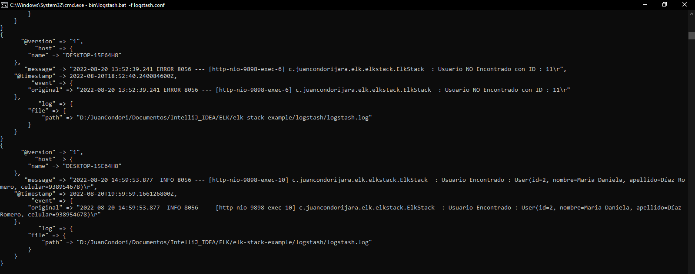

# **ELK(Elasticsearch-Logstash-Kibana) + Spring Boot Microservice**
Registro centralizado en la arquitectura de microservicios utilizando ELK(Elasticsearch-Logstash-Kibana) + Spring Boot Microservice

## **ELK Caracaracterística**

## **ELK en la demo**

## **Requisito Java 17 para Elasticsearch**

- __[Java 17](https://www.oracle.com/java/technologies/downloads/#jdk17-windows)__

## **Descargar ELK**

- __[Elasticsearch](https://www.elastic.co/es/downloads/elasticsearch)__
- __[Logstash](https://www.elastic.co/es/downloads/logstash)__
- __[Kibana](https://www.elastic.co/es/downloads/kibana)__

## **ELK en acción**

- Spring Boot Microservice

- Elasticsearch

- Kibana

- Logstash

## **Bibliografía**

- __[Youtube - Cómo Descargar e Instalar Java JDK 17 en Windows 10](https://www.youtube.com/watch?v=BG2OSaxWX4E)__

- __[Youtube - Guía sencilla paso a paso sobre cómo instalar Elastic, Kibana y Log stash Stack 8.3 en Windows 10](https://www.youtube.com/watch?v=BybAetckH88)__

- __[Youtube - Registro de microservicios | ELK Stack | Elastic Search | Logstash | Kibana](https://www.youtube.com/watch?v=5s9pR9UUtAU)__
